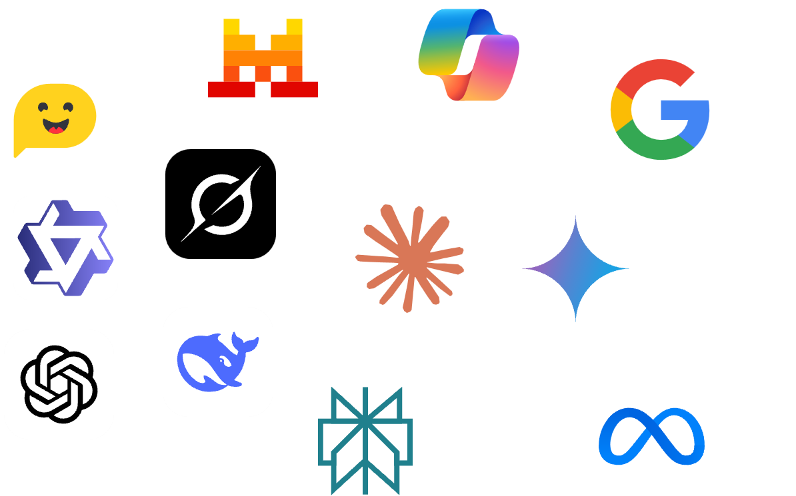
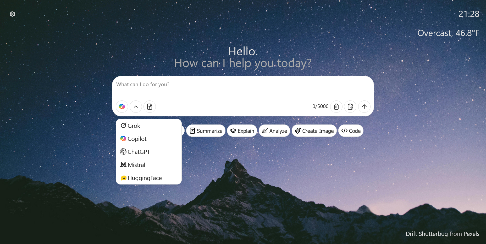
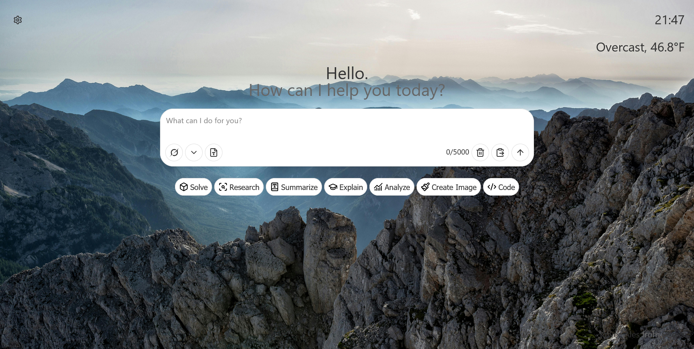
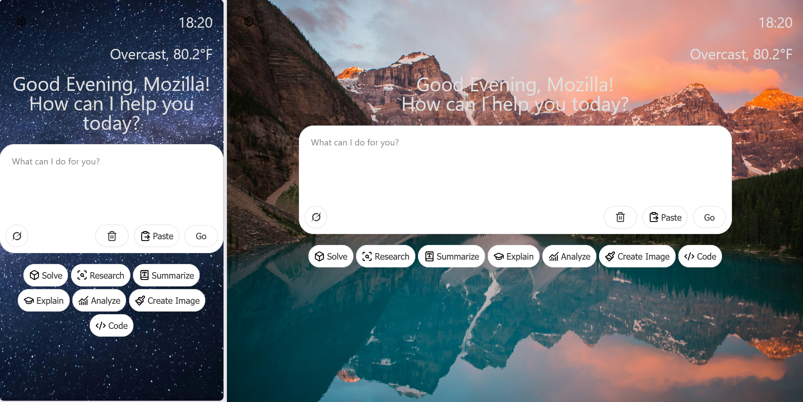
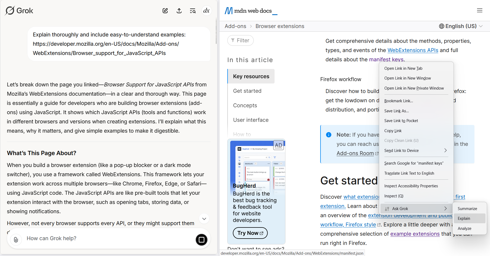
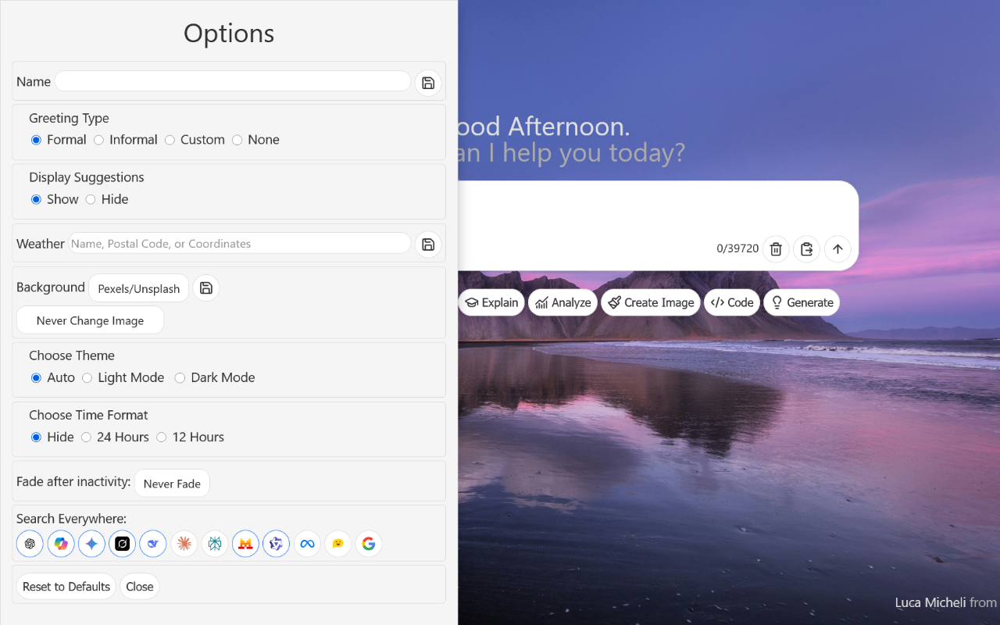

# Tabbed: AI chatbot in New Tab and Sidebar

A new tab page with an AI-like user interface.

## Youtube Video
[](https://www.youtube.com/watch?v=PDgovF1dNBg)

## How to run from source

### Chrome

- Run `compile.sh` to move the files from `src` to the `chrome/src` folder.
- Go to [`chrome://extensions`] and enable Developer mode
- Load the unpacked extension by selecting the `chrome/src` folder where the `manifest.json` resides.

### Firefox

- Set `xpinstall.signatures.required` to `false` from [`about:config`](about:config)
- Zip inside `src` directory as
  ```sh
  cd src
  7z a ../tabbed.zip . # or any other zip archivers, such as zipping from File Explorer
  ```
- Install the custom addon at [`about:addons`](about:addons) by selecting the zipped file

## Features

### Supported Chatbots

- [Grok](https://grok.com)
- [Copilot](https://copilot.microsoft.com)
- [ChatGPT](https:///chatgpt.com)
- [Mistral](https://mistral.ai)
- [Perplexity](https://perplexity.ai)
- [HuggingFace](https://huggingface.co/chat/)
- [DeepSeek](https://chat.deepseek.com/) (Experimental)
- [Gemini](https://gemini.google.com/app) (Experimental)
- [Claude](https://claude.ai/new)(requires manual clicking)
- [Meta AI](https://meta.ai) (requires manual clicking)
- [Google (AI Mode)](https://google.com)

### Basic

- Clean UI adapted from ChatGPT and Grok
- Ability to switch between different AI chatbots/websites
- Paste text into the prompt
- Eight default suggestion ideas to save time on commands.
  
- Click on the Extension Icon:
  - To launch your current AI chatbot in a new Tab.
- Permissions are optional but extend the basic features. You can revoke them any time by pressing "reset" in the options menu.
- Context menus provide suggestions as your browse and select text.

### Sidebar features (Firefox Only)

- Open the sidebar to access the chatbots as well.
  
- Context menus provide suggestions as your browse
  

## Optional Features (in Options)

- Allow a custom name for greeting
- Set weather and time
- Set light/dark mode
- Set the background Image using Unsplash/Pexels, or your own image.
- Fade the chatbox after inactivity
- Gemini and DeepSeek is currently supported using Experimental content scripts (Permissions: scripting). You can revoke them at any time by pressing "reset" or the "beaker" button.
  
