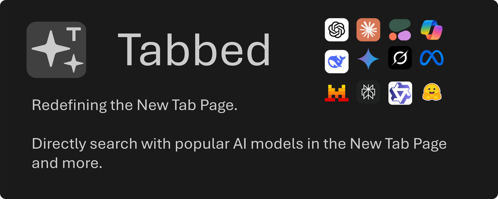
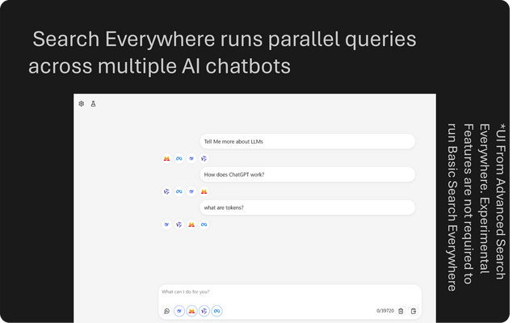
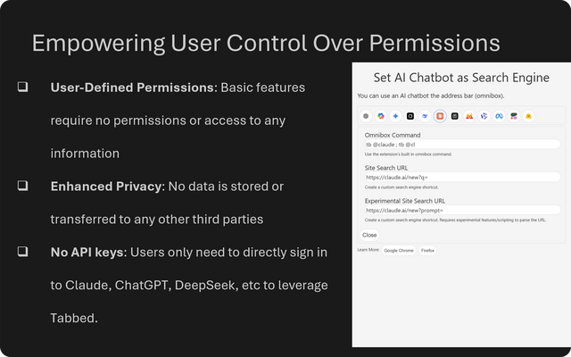
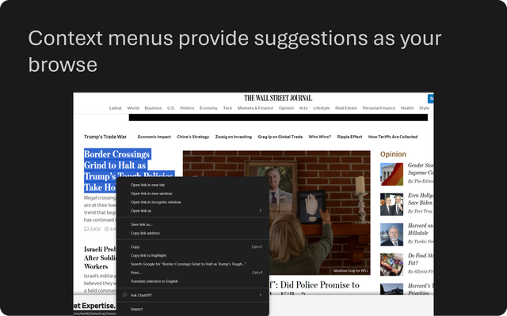
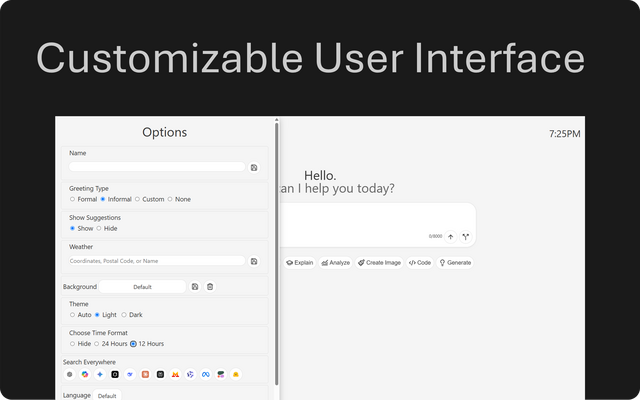
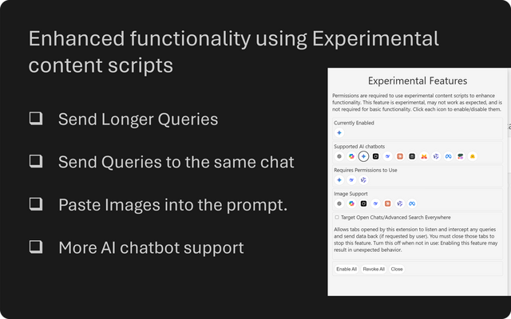

# Tabbed: AI chatbot in New Tab and Sidebar

A new tab page with an AI-like user interface. Note: You may have to sign in to the respective AI chatbot for it to work. Stop paying and sending your data to third-parties when you can directly use the AI chatbot with this extension.
[](https://chromewebstore.google.com/detail/jbpmodbjedoloelbepnpfhjoohjjkand)
[](https://addons.mozilla.org/en-US/firefox/addon/tabbed/)
[](https://github.com/DerivedFunction/bookish-octo-robot/)

## Youtube Video

[](https://www.youtube.com/watch?v=PDgovF1dNBg)

## Compile and Package from Source

```sh
npm install # install relevant dependencies from package.json
chmod +x compile.sh
./compile.sh # run webpack to build our dist/ and move files to chrome/ and firefox/
# Make sure to zip the files
# Inside compile.sh, I chose 7z
# echo "Zipping with 7z"
# cd chrome
# 7z a ../tabbed-chrome.zip .
# cd ../firefox
# 7z a ../tabbed-firefox.zip .
```

## Develop and Test from source

```sh
chmod +x dev.sh
./dev.sh # Move files from src/ to test/firefox and test/chrome
```

### Chrome

1. Enable developer mode in [`chrome://extensions`](chrome://extensions)
2. Click on load unpacked extension
3. Select the `chrome/` folder. This is where `manifest.json` resides.

### Firefox

1. Install Firefox Developer/Nightly
2. Go to [`about:config`](about:config) and set `xpinstall.signatures.required` to `false`
3. Install the custom addon at [`about:addons`](about:addons) by selecting the `tabbed-firefox.zip` file

## Features

### Supported Chatbots

- [Grok](https://grok.com)
- [Copilot](https://copilot.microsoft.com)
- [ChatGPT](https:///chatgpt.com)
- [Mistral](https://mistral.ai)
- [Perplexity](https://perplexity.ai)
- [Kimi](https://kimi.com/) (Experimental)
- [DeepSeek](https://chat.deepseek.com/) (Experimental)
- [Qwen](https://chat.qwen.ai/) (Experimental)
- [Gemini](https://gemini.google.com/app) (Experimental)
- [Claude](https://claude.ai/new) (requires manual clicking)
- [Meta](https://meta.ai) (requires manual clicking)
- [Cohere](https://coral.cohere.com)
- [Poe](https://poe.com) (Experimental)
- [You.com](https://you.com)

### Basic

- Clean UI adapted from ChatGPT and Grok
- Ability to switch between different AI chatbots/websites.
- Powerful **Search Everywhere** allows the same query to simultaneously run on multiple AI chatbots
  
- Paste text into the prompt
- Eight default suggestion ideas to save time on commands.
- Click on the Extension Icon:
  - To launch your current AI chatbot in a new Tab.
- Omnibox with keyword `tb`. (Try typing `tb @cg Hello` in the address bar)
  
- Permissions are optional but extend the basic features. You can revoke them any time by pressing "reset" in the options menu.
- Context menus provide suggestions as your browse and select text.
  

### Sidebar features (Firefox Only)

- Open the sidebar to access the chatbots as well.
- Context menus provide suggestions as your browse

## Optional Features (in Options)

- Allow a custom name for greeting
- Set weather and time
- Set light/dark mode
- Set the background Image using Unsplash/Pexels, or your own image.
- Fade the chatbox after inactivity

  

## Experimental Features (in Experimental)

- **Gemini**, **DeepSeek**, **Meta** and **Qwen** is currently supported using Experimental content scripts (Permissions: scripting). You can revoke them at any time by pressing "reset" or the "beaker" button.
- Send longer queries
- Send Queries to the same chat
- Paste Images into the prompt.
- Advanced Search Everywhere function
  
